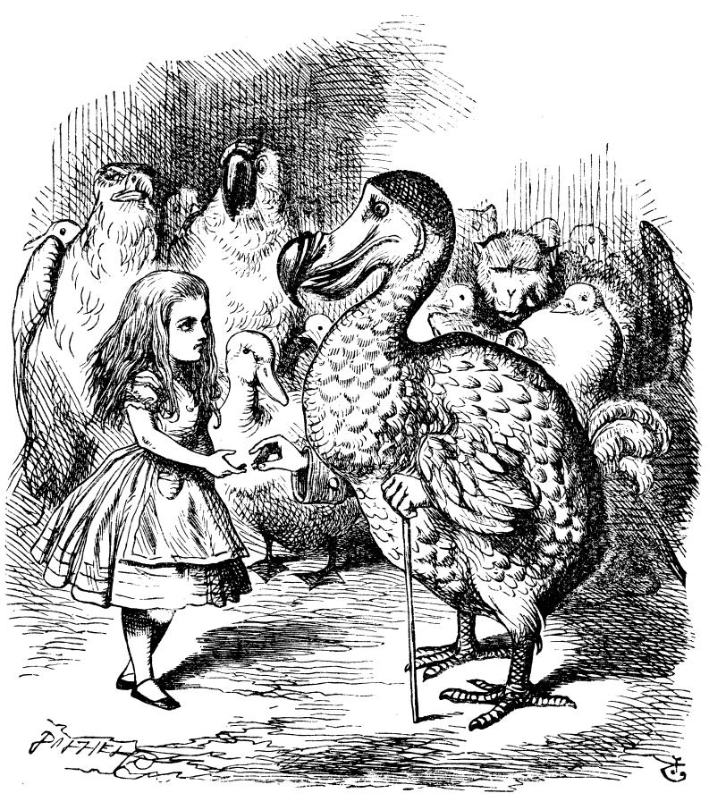
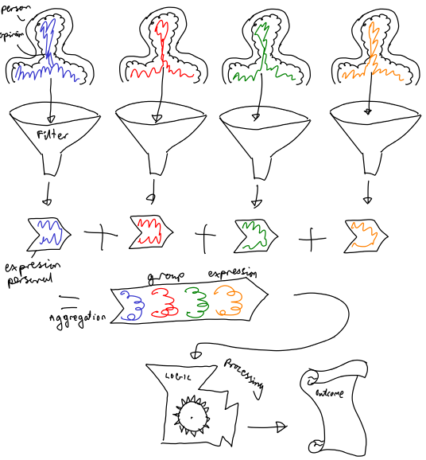

# Book Bucket 

_A whole bunch of half-finished stuff, ideas, links, etc which eventually should go somewhere_

## Resources

* [gitbook.com](https://toolchain.gitbook.com) - GitBook manual
* [writersandeditors.com](http://www.writersandeditors.com/preface__foreword__or_introduction__57375.htm) - _"A preface or foreword deals with the genesis, purpose, limitations, and scope of the book and may include acknowledgments of indebtedness; an introduction deals with the subject of the book, supplementing and introducing the text and indicating a point of view to be adopted by the reader. The introduction usually forms a part of the text [and the text numbering system]; the preface does not."_

## References/Reading

* Rosenberger, J. (2009). _Konflikte human lösen_ [lang:de] ISBN-13:9783816924579 
* Falkvinge, R. (2013). _Swarmwise - The Tactical Manual to Changing the World_ [Accessed [here](https://falkvinge.net/files/2013/04/Swarmwise-2013-by-Rick-Falkvinge-v1.1-2013Sep01.pdf) on 2016-10-07] 
* Dunbar, R.I.M. (1992). _Neocortex size as a constraint on group size in primates_ [Accessed [here](http://isites.harvard.edu/fs/docs/icb.topic514568.files/Dunbar_Neocortex%20size%20as%20a%20constant%20on%20group%20size%20in%20primates.pdf) on 2016-10-07]
* Miller, G.A. (1956). _The Magical Number Seven, Plus or Minus Two: Some Limits on our Capacity for Processing Information_ [Accessed [here](http://cogprints.org/730/1/miller.html) on 2016-10-07]
* Laloux, F. (2014). _Reinventing organizations_ [Accessed via pay-as-you-feel [here](http://www.reinventingorganizations.com/pay-what-feels-right.html) on 2016-XX-XX]
* Krause, A. (2015). _No Boss Does Not Mean No Leadership_ [Accessed [here](https://medium.com/search?q=no%20boss%20does%20not%20mean%20no%20leader) on 2016-10-07]
* Agnew, Z. (2016). _How to Nurture Living and Evolving Doocracy_ [Accessed [here](https://medium.com/embassy-network/an-evolving-doocracy-3a6123f9b170?source=bookmarks---------1-) on 2016-10-07]
* Ruble, T.L. and Thomas, K.W. (1976). _Support for a two-dimensional model of conflict behavior_ [Perhaps accessible [here](http://www.sciencedirect.com.sci-hub.bz/science/article/pii/0030507376900106)]
* Schwarz, G. (2005). _Konfliktmanagement - Konflikte erkennen, analysieren, lösen_ [lang:de], Gerhard Schwarz [Perhaps accessible [here](http://libgen.io/search.php?req=978-3-8349-4598-3&open=0&res=25&view=simple&phrase=1&column=identifier)]
* Visotschnig, E., Schrotta, S., _et al._ (from 2001). _[sk-prinzip.eu/](http://www.sk-prinzip.eu/)_ (The original Systemisches Konsensieren site) [lang:de]
* Freeman, J. (1973). _The Tyranny of Structurelessness_ [Accessed [here](http://www.jofreeman.com/joreen/tyranny.htm) on 2016-10-08]
* Surowiecki, J. (2004). _The Wisdom of Crowds_ [Perhaps accessible [here](http://www.asecib.ase.ro/mps/TheWisdomOfCrowds-JamesSurowiecki.pdf)]
* Glasl, F. (1994). _Friedrich Glasl, Konfliktmanagement - Handbuch für Führungskräfte . Beraterinnen und Berater_ [lang:de] [Perhaps accessible [here](http://libgen.io/search.php?req=978-3-531-92789-3_4&open=0&res=25&view=simple&phrase=1&column=identifier)]
* Tuckman, B.W. (1965). _Developmental Sequence in Small Groups_ [Accessed [here](http://web.mit.edu/curhan/www/docs/Articles/15341_Readings/Group_Dynamics/Tuckman_1965_Developmental_sequence_in_small_groups.pdf) 2016-08-10]
* Alós–Ferrer, C. and Granić, Ð. (2009). _Approval Voting in Germany: Description of a Field Experiment_ [Accessed [here](http://www.rangevoting.org/AVGermany.pdf) on 2016-10-09]
* Smith W.D. (2000). _Range voting_ [Accessed [here](http://scorevoting.net/WarrenSmithPages/homepage/rangevote.pdf) on 2016-10-09]
* Hackman, J.R. and Vidmar, N. (1970). _Effects of Size and Task Type on Group Performance and Member Reactions_ [Perhaps accessible [here](http://www.jstor.org.sci-hub.bz/stable/2786271?seq=1#page_scan_tab_contents)]
* Reed, D.P. (2001). _The Law of the Pack_ [Accessed [here](https://hbr.org/2001/02/the-law-of-the-pack) on 2016-10-10]
* Kovarik, B. (2015). _Revolutions in Communication: Media History from Gutenberg to the Digital Age_
* https://en.wikipedia.org/wiki/David_Sarnoff
* Metcalfe, R. (1995). _Metcalfe's Law: A network becomes more valuable as it reaches more users._ [Accessed [here](https://books.google.de/books?id=XDoEAAAAMBAJ&pg=PA53&lpg=PA53&dq=Metcalfe%27s+Law:+A+network+becomes+more+valuable+as+it+reaches+more+users.+Infoworld,+Oct.+2,+1995.&source=bl&ots=NWnb6DQsdX&sig=CwWrELsjPXoKGiW9ADvV_k09Fb4&hl=en&sa=X&ved=0ahUKEwiE2_3xi9HPAhXDRhQKHYn2CnYQ6AEIOTAG#v=onepage&q=Metcalfe%27s%20Law%3A%20A%20network%20becomes%20more%20valuable%20as%20it%20reaches%20more%20users.%20Infoworld%2C%20Oct.%202%2C%201995.&f=false) on 2016-10-10]
* Odlyzko, A and Tilly, B. (2005). _A refutation of Metcalfe's Law and a better estimate for the value of networks and network interconnections_ [Accessed [here](http://www.dtc.umn.edu/~odlyzko/doc/metcalfe.pdf) on 2016-10-11]

## To get

* Paper about people feeling connected getting on better
* Scobles number: https://bhc3.com/2009/02/16/forget-dunbars-number-our-future-is-in-scobles-number/
* Allen Curve - distance vs communication. https://en.wikipedia.org/wiki/Allen_curve
* Agile camp cool slides: http://www.slideshare.net/AgileCampSV/agilecamp-2015-keynote-scrum-is-a-productivity-superweapon-jeff-sutherland
* spotify structure: https://ucvox.files.wordpress.com/2012/11/113617905-scaling-agile-spotify-11.pdf
* Valve book: http://www.valvesoftware.com/company/Valve_Handbook_LowRes.pdf
* Metcalfe’s Law Opportunity Gap.- https://bhc3.com/2010/01/19/why-smbs-need-social-software-dunbars-number-limits-metcalfes-law/
* http://ska.quicquid.org/
* https://hbr.org/2001/02/the-law-of-the-pack many to many
* http://www.slideshare.net/KaiNexus/the-art-and-science-behind-a-successful-lean-transformation

# Value of a group

More people is good: division of labour, economy of scale... The value of a group relative to the number of members has been theorized by many

**Sarnoffs law.** The value of a group increases directly proportional to the number of members. Coming from one-to-many broadcasting company. 

$$ V = N $$

**Metcalfes law.** The value of a group increases proportional to the square of the numbers of members. Coming from number of unique one-to-one interactions of telephones, birth of the internet days. 

$$ V = (N(N-1))/2 \approx N^2 $$

**Reeds law.** The value of a group increases proportional to the square of the numbers of members. 

$$ V = 2^N-N-1 \approx 2^N $$
  
**Odlyzko and Tilly.** 

$$ V = Nlog(N) $$

## Non-zero-sum games (Concept most relevant wrt 

What if there were only winners? Alice experiences this in Wonderland:

> ...the Dodo suddenly called out "The race is over!" and they all crowded round it, panting, and asking, "But who has won?"
>
> This question the Dodo could not answer without a great deal of thought ... 
>
> At last the Dodo said, "*Everybody* has won and all must have prizes."

Secretly belies monolithic belief system.

## Human evolution

Humans are pretty interesting animals, but animals after all. At one point a long time ago, humans didn't have language like we know it today. At that time humans also didn't computers, tooth-brushes, watches, hair gel, marriage, police and many other things. 

Primates are some of the closest relatives to humans. They form social groups - a number of individuals which can be observed to have ongoing relationships. In many genera of primates the group is lead by an alpha individual, an individual that the other individuals follow. An individual may challenge the alpha which typically leads to physical fighting - the winner becomes or remains the alpha.

Being social takes brains. Robert Dunbar studied 38 genera of primates and found a direct correlation between the Neocortex ratio and average social group. The Neocortex is the most recently evolved part of the brain and is involved in spatial reasoning, sensory perception, language and more. Dunbar predicted that humans had an average social group size of ~150 in survival conditions.

The development of language enabled humans to form larger and more complex groups. The development of written language enabled even larger and more complex groups.

Decision making was able to scale past the social group limit through power hierarchies: Kingdoms, Empires, Caliphates, etc. These were all typically enforced by fear of physical and/or divine punishment. The classic image of a pyramid comes to mind, where those at the top command those below, who command those below, etc. Now magnitudes more people could work together or specialize! Here come castles, roads, cannons, looms, etc - nice.

The intrinsic problem with power hierarchies is that most of the people doing the work don't get to make the decisions. If the King is 'good', most people may be happy with their rule. But if the King is 'bad' it could be that most of the people are unhappy with their rule, the result of which has usually not been so pretty. (See French Revolution, Independence of USA from England, etc, etc). Whether the King is 'good' or 'bad', their intelligence of their Kingom is limited to what they can see and the individuals down the pyramid are passivated. 

With literacy becoming more widespread, someone had the great idea to periodically ask everyone who they wanted to be the ruler. This is widely agreed to be the basis of democracy. Now for the first time, the people doing the work got to decide who should rule! (Unless you were a slave, migrant, prisoner or female) This lead to less revolts, coups and civil wars - nice. 

## Consent in the Swedish Pirate Party

Rick Falkvinge describes the 'consensus circle' used during the founding years of the Swedish Pirate Party in his book [Swarmwise](http://falkvinge.net/2013/02/14/swarmwise-the-tactical-manual-to-changing-the-world-chapter-one/) (pg 165-169). The following method was reportedly used by a group of 25 people:

"*The method as such appears quite simple, but with powerful results: The group gathers in a room. Everybody takes turns speaking about what is important to him or her about the issue, under a time limit of sixty seconds. (It could be forty-five, it could be ninety, but should be thereabouts. Somebody is assigned to use a stopwatch to time the speaking slots.) Everybody can spend his or her sixty seconds however he or she likes: by speaking about the issue at hand, by sitting in silence, by singing an unrelated song, or by dropping to the floor doing push-ups. The idea is that everybody will be discussing the issue, but the point is that each person can spend his or her time slot as he or she likes, and may not be interrupted by anyone during that time slot. Again, empower people. But once the sixty seconds are up, it’s the next person’s turn, going in a circle around the room in one direction of the circle, starting over on coming full circle and giving everybody another time slot, until everybody is in agreement on the issue at hand.*

*Here’s the important part: everybody has the power of veto over a final decision. One single “no” from any participant is a final “no” for the group as a whole. Therefore, nobody will leave the room as a loser. This creates two very powerful mechanisms: the first is that it forces everybody to find a solution that is acceptable to everybody, and the second is that it slowly releases all fears of leaving the room as a loser, creating a completely different mind-set from the one surfacing when fighting internally.*

*It is equally important that everybody respects this and doesn’t use any kind of peer pressure whatsoever to make somebody not exercise his or her right of veto. Everybody in the room has the power to block the final decision, and it is everybody’s responsibility to find a solution that isn’t blocked by anyone. Any attempts to belittle somebody’s right to block a decision must be immediately stopped, reinforcing the respect for everybody’s power of veto and the equality in the room.*

*When we discussed the issue in question in this large group of twenty-five people in the Swedish Pirate Party, it took two full rounds of speaking to see a complete transformation in attitude. Those who had come into the room prepared to stall, fight, and delay a decision out of fear of losing had lost all such sentiments, and displayed inclusion in the decision-making process. This, in turn, made the decision making take considerably less time than if we had used a traditional voting method, even when starting from ridiculously diverse viewpoints and giving everybody the power of veto.*"

## Consensus in Buurtzorg 

Frederic Laloux describes the decision making process used by Buurtzorg teams in his book [Reinventing Organizations](http://www.reinventingorganizations.com/) (pg 67-68). Buurtzorg is a nursing organization and the teams of nurses are typically 10 to 12 in number:

*"The group first chooses a facilitator for the meeting. The agenda of topics to be discussed is put together on the spot, based on what is present for team members at that moment in time. The facilitator is not to make any statements, suggestions, or decisions; she can only ask questions: “What is your proposal?” or “What is the rationale for your proposal?” All proposals are listed on a flipchart. In a second round, proposals are reviewed, improved, and refined. In a third round, proposals are put to a group decision. The basis for decision-making is not consensus. For a solution to be adopted, it is enough that nobody has a principled objection. A person cannot veto a decision because she feels another solution (for example, hers!) would have been preferable. The perfect solution that all would embrace wholeheartedly might not exist, and its pursuit could prove exhausting. As long as there is no principled objection, a solution will be adopted, with the understanding that it can be revisited at any time when new information is available. The meeting process elegantly ensures that every voice is heard, that the collective intelligence informs decision-making, and that no one person can derail the process and hold others hostage trying to impose her personal preferences."*

## Describing the landscape 

Groups are people acting together, decisions are promises towards the future. How do groups make decisions? What impact does how things get decided (the process) affect what gets decided (the outcome)? So, not everything is perfect right now... You've probably been raised with a limited range of decision making systems but there are more. The more people in a group that make a group decision, the better the decision is. Chance can be considered a fair way of making decisions when everything is already equal... games. Authority is a well recognized way of making decisions and scales to empires... but people don't like it in the long run as they can't be heard. Autonomy is fair, but uncoordinated and can be difficult to build complexity. Majority voting comes in many flavours and allows everyone to participate but can divide people. Consent can be fine for small, stable groups but does not scale well. Consensus seeks consent but will move forwards as best possible otherwize. Systemic consensus is a consensus technique employing a voting system... 

## Title 

Groups
Decisions
Systemic consensus
Manual
Theory
Practice
Maths
Sociology
Philosophy

## Positions

* If people are unable to express themselves honestly, they won't.
* Let not the majority force itself upon the minority, nor a minority hold back the majority.
* Good and bad are relative terms that don't exist in a vacuum.
* Few things are binary. Really few. Most things are scalar.

## Model

* **Feelings.** The natural, honest and internal feelings towards the options.
* _Filtration._ The filter through which feelings must pass. (the permitted expression)
* **Individual expression.** The transmitted expression. (cardinal or ordinal values)
* _Aggregation._ Aggregation process.
* **Group expression.**
* _Processing._ Decision rules. 
* **Decision.**

$$ Persons: x, y, z $$

$$ On\ options: n, m, o $$

$$ Personally\ expressed: \{xn,xm,xo\}, \{yn,ym,yo\}, \{zn,zm,zo\} $$

$$ Which\ when\ aggregated\ using: j $$

$$ To\ group\ expression: [an, bm, co] $$

$$ And\ when\ applying\ logic: k $$

$$ Identifies\ the\ best\ group\ decision\ as\ option: m $$

## The life of a decision

dissent identification
exploration (proposals formed, options identified,
decision (consent > compromize > delegation > domination > destruction > flight)
implementation

## Words

_All etymology thanks to etymonline.com_

dissent (v.) Look up dissent at Dictionary.com
    early 15c., from Latin dissentire "differ in sentiments, disagree, be at odds, contradict, quarrel," from dis- "differently" (see dis-) + sentire "to feel, think" (see sense (n.)). Related: Dissented; dissenting. The noun is 1580s, from the verb.

        Has there ever been a society which has died of dissent? Several have died of conformity in our lifetime. [Jacob Bronowski "Science and Human Values," 1956]

consent (v.) Look up consent at Dictionary.com
    early 13c., from Old French consentir (12c.) "agree, comply," from Latin consentire "feel together," from com- "with" (see com-) + sentire "to feel" (see sense (n.)). "Feeling together," hence, "agreeing, giving permission," apparently a sense evolution that took place in French before the word reached English. Related: Consented; consenting.
    
conflict (v.) Look up conflict at Dictionary.com
    early 15c., from Latin conflictus, past participle of confligere "to strike together, be in conflict," from com- "together" (see com-) + fligere "to strike" (see afflict). Related: Conflicted; conflicting.

decide (v.) Look up decide at Dictionary.com
    late 14c., "to settle a dispute," from Old French decider, from Latin decidere "to decide, determine," literally "to cut off," from de- "off" (see de-) + caedere "to cut" (see -cide). For Latin vowel change, see acquisition. Sense is of resolving difficulties "at a stroke." Meaning "to make up one's mind" is attested from 1830. Related: Decided; deciding.

implement (v.) Look up implement at Dictionary.com
    "to complete, perform, carry into effect," 1707, originally chiefly in Scottish English, where the noun was a legal term meaning "fulfillment," from implement (n.). It spawned implementation, which is first recorded 1913. Related: Implemented; implementing.
    
sense (n.) Look up sense at Dictionary.com
    c. 1400, "faculty of perception," also "meaning, import, interpretation" (especially of Holy Scripture), from Old French sens "one of the five senses; meaning; wit, understanding" (12c.) and directly from Latin sensus "perception, feeling, undertaking, meaning," from sentire "perceive, feel, know," probably a figurative use of a literally meaning "to find one's way," or "to go mentally," from PIE root *sent- "to go" (source also of Old High German sinnan "to go, travel, strive after, have in mind, perceive," German Sinn "sense, mind," Old English sið "way, journey," Old Irish set, Welsh hynt "way"). Application to any one of the external or outward senses (touch, sight, hearing, etc.) in English first recorded 1520s.

        A certain negro tribe has a special word for "see;" but only one general word for "hear," "touch," "smell," and "taste." It matters little through which sense I realize that in the dark I have blundered into a pig-sty. In French "sentir" means to smell, to touch, and to feel, all together. [Erich M. von Hornbostel, "Die Einheit der Sinne" ("The Unity of the Senses"), 1927] 

    Meaning "that which is wise" is from c. 1600. Meaning "capacity for perception and appreciation" is from c. 1600 (as in sense of humor, attested by 1783, sense of shame, 1640s).
   
coordination (n.) Look up coordination at Dictionary.com
    also co-ordination, c. 1600, "orderly combination," from French coordination (14c.) or directly from Late Latin coordinationem (nominative coordinatio), noun of action from past participle stem of Latin coordinare "to set in order, arrange," from com- "together" (see com-) + ordinatio "arrangement," from ordo "order" (see order (n.)). Meaning "action of setting in order" is from 1640s; that of "harmonious adjustment or action," especially of muscles and bodily movements, is from 1855
    
cooperation (n.) Look up cooperation at Dictionary.com
    late 15c., from Middle French coopération, or directly from Late Latin cooperationem (nominative cooperatio) "a working together," noun of action from past participle stem of cooperari "to work together," from com- "with" (see com-) + operari "to work" (see operation).

----

Orientation: facing east (or any other direction)  
Collaboration - Identify ways in which you might go North. 
Coordination - What is North? Do you want to go North? Decide the way. 
	Coordinate: order together
Cooperation - Work together to implement the decision.
	Cooperate: work together
Organize: construct/establish (from organ)

 ---> Coordination ----
|                      |
 ---- Cooperation <----

Group decisions are better when individuals express what they actually feel. Methods that are better at allowing people to express what they actually feel lead to better decisions. Chance has no individual expression. Authority has few individuals expressing how they feel and others are forced. Individual autonomy doesn't

Discussion is a generative process, that is, you build more options, not identify fewer.

Scale, Acceptance, Intelligence

majority 

majority methods aim to select the option suported by most people. This thus is thus a dominative approach to dealing with dissent: the biggest/strongest group getting what they want.  may come from the thinking that it is better 

ovpb/single/singular/simple/binary
	plurality (a.k.a. absolute majority)
	majority (a.k.a. relative majority
	supermajority
		Two round system
	
	
	
	
	Instant Runoff Voting (Preferential voting, alternative vote)
	Contingent vote
	
	
	

	
