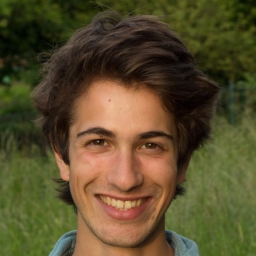

# Contributors

## Doug Webb

_Writer, editor, coordinator, researcher and some basic IT stuff_

Twitter: [@DougInAMug](https://twitter.com/DougInAMug) | Website/blog: [mindbleedofdoug.com](....) | Contributing to [yunity.org](https://yunity.org) 

<!--
# Perhaps cool if we write the bio of another... blanking.

What is important to me

Chemistry
experiences
hope
many other problems due to people not cooperating but competing

Saw problems, realized they were connected, currently focussed on people.  

For some years now my mind keeps returning to the subject of how people organize. The question that subsequently keeps me up at night is: How can people like you and I arrange ourselves to do the things we want with less wasted energy, time and resources and more equality, autonomy and joy? 

I've been lucky to participate in a lot of different groups in a lot of ways: the first child in a nuclear family of 5, a citizen of Scotland/The United Kingdom/The European Union, a pupil in a state school, the head boy of a high school, a member at a church AGM, a student at a university, a user of a buyer cooperative, a volunteer at a worker cooperative, an employee of a corporation, a researcher in a PhD team, a voter in a national referendum, a camper at a protest village, a resident of an occupied building, a journeyman in a tribe of nomads... 

You may think that _voluntary = without money = personally unsustainable._ So did I once, not so now. Please see my blog/site and yunity.org for how you too can decouple your desires from your survival
-->

## Thanks 

Joachim Thome, Konrad Becker, Luke Scheliga, Chris ?, Erich Visotschnig, Siegfried Schrotta, Volker Visotschnig
