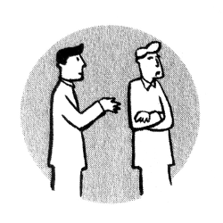

# Dissent

> dissent (v.) 
>
> early 15c., from Latin dissentire "differ in sentiments, disagree, be at odds, contradict, quarrel," from dis- "differently" (see dis-) + sentire "to feel, think" (see sense (n.)
>
> -- [etymonline.com](http://www.etymonline.com/index.php?term=dissent)

Dissent happens and that's OK! In fact as used here - a difference in feeling or thought - dissent happens to everyone all the time. In and of itself dissent is neither good nor bad but presents an opportunity, the response to which can be 'good' or 'bad'; A bad response is an exaggerated one, but the worst is to ignore it. Even if the difference is severe, the resonse need not be. Dissent always originates in the eye of the beholder and can not exist in a vacuum. Other synonyms include driver[^sociocracy 3.0], tension, motive or conflict. 

It can occur within one person when presented with multiple, exclusive options or the presence of opposing feelings simultaneously such as pleasure and guilt. The observant observer can sometimes detect that a person might have an internal dissent by what they communicate; perhaps unusual quietness, a confused look, or some other unique indicator.

Between people dissent can occur when people have different goals, perceptions, behaviors... take your pick. Could be as subtle as not knowing which film you want to watch film or as obvious as being angry with someone who calls you names. Whether dissent is a concern, problem or mega-conflict is completely dependent on the intensity with which the observer senses. How do we respond to it? 

Without getting lost too lost in detail, if it feels like a dissent, it is.

## Response

So, responding to dissent, how can that be approached? A one-dimensional perspective might be a scale from competition to cooperation with compromise somewhere in the middle. A two-dimensional perspective using 'cooperativeness' and 'assertiveness' (Rubel and Thomas, 1976) includes the previous approaches and adds avoidance and accommodation;

A further two approaches are destruction and delegation (Schwarz, 2005) and these along with the previously mentioned approaches are individually considered roughly from 'worst' to 'best' below.

### Flight/Avoidance

Not dealing with a dissent is a valid approach but requires one or more party to change their behaviour. The very major disadvantage is that the dissent remains intact and the avoidance behaviour must be indefinitely maintained.

Example: Talking about a trigger topic. In 2016 Bill and Ted found it fell out whilst talking about the US Presidential Elections leading to Ted storming out of the house. In later conversations both of them consciously avoided the issue, sometimes having to awkwardly stop mid-sentence and try to think of something else to say...

### Destruction

Whilst the initial dissent may sometimes be resolved with this approach, multiple and more severe dissent will often take it's place.

### Domination/Accommodation

Bad precedent for future, passivity, fresh dissent (latent).

### Delegation

Both parties their self-determination and reduce their ability to solve problems in future.

### Compromise/Consensus

Parties may not have a lot of enthusiasm to actively cooperate if compromise is large.

### Consent

Disadvantage is that it can lead to firm delusions that a more hopeful world is possible.

> Has there ever been a society which has died of dissent? Several have died of conformity in our lifetime.
>
> -- Jacob Bronowski "Science and Human Values," 1956

<!--
what do i want to say...

Dissent is not bad at all - nor is it good, it simple the presence of difference. How we deal with difference can be good or bad. Exaggeration is bad, ignoring is worse. Approaches could be one dimensional into competition or cooperation, old. Could be considered with a second dimension of assertiveness/energy: R&T did this and identified compromize. Schwarz identifies Delegation to a third party and destruction of the conflict. One dimensional view
Ruble and Thomas: Two dimensional view
Schwarz: orders 6 conflict resolution strategies including externalization (delegation).
Glasl: 9 stages
-->
