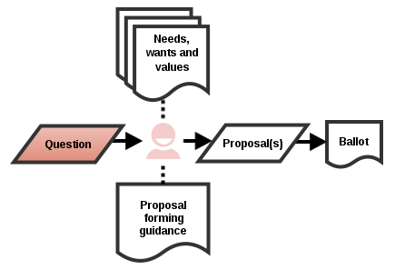

# Systemic Consensus

xAgain, Systemic Consensus is a simple, scalable and consent-oriented decision making framework. It is founded on **3 principles**. There are many **formats** in which the process can occur provided the required **features** are present. **theory** resistance, enthusiasm, why resistance first imporant. 

## Principles ##
  * No rush
  * Strategy diversity
  * Focus on needs
  
## Features ##
  * Action taken to facilitate connection to promote consent outcomes. 
  * Control options always included in ballot.
  * Ballots always have more than two option.
  * Each option rated using a scale of resistance.
  * Option with least resistance selected.
  * Decisions can always be reevaluated.
  
* Phases
  * Personal connection
  * Proposal forming
  * Resistance rating
  * Question forming
  * Participant self-selection
  * Evaluation and decision implementation
  * Reevaluation

## The Question ##

*Phrasing the motive for action in a positive and generative way.*

As the input for an intensive process, good questions are good. Questions that have been formed well are evidenced by how happy people are to answer them. The following text provides some points for the consideration of people forming questions or helping others form questions.

Becoming **self-aware** is a great starting point. What are you thinking and feeling? What is currently conscious and subconscious? In many cases questions form from the perception of a problem. What is the main aspect of the problem? What are the details of the problem? This line of inquiry can already lead to more refined questions. Other probing questions include:

* Am I emotionally affected by this issue?
* Do I already know what I want the answer to be?
* Is what I'm thinking coherent for others?
* Is it helpful for me, my team or the world to ask this question?

Making sure you are **informed** also pays off. Some questions can be answered with a relatively small amount of personal research compared to the effort required to gather a group to find a solution. Having transparency of internal information will greatly help here! Even though research will not always enable you to find the solution, doing so will enable you to form better questions and subsequently better proposals.

Writing **clear** questions in a way that is understandable to participants reduces confusion and helps people to form relevant proposals. This does not mean questions have to be narrow: broad questions can often lead to more creative proposals, the important part is to communicate your intention clearly. Removing ambiguity is an essential part writing clearly, for instance acronyms should be expanded and specifics should be made explicit. Clear questions are also concise, that is they are just the right length: not too short or long.

**Open** questions are generative. Specifically, the do not encourage people into yes/no mind-sets *(majority legacy warning!)*. Be conscious that if you have been thinking about an issue for some time and have arrived at a proposal, there is a tendency to phrase your proposal as a question. Stepping back to the original question allows the rest of the team to work through the thought process together.

**A good question**

    How should we create and maintain our website? 

This question is clear and open. Many people, even non-technical types can understand what it's asking and are invited to make creative proposals.

**A not so good question**

    Should we switch to Joomla?

This question is neither clear nor open. Switch *what* to Joomla? Using technical language in a way that is familiar to specialists alienates many people from understanding. It also encourages participants into yes/no mentality - it might not be obvious to some people there are other options to switching to Joomla or remaining with the status quo.

A final note is that Systemic Consensus is self-healing: People can make any proposals they want and the proposal with least resisted will be selected. As such, even if an awfully worded question was put forward, it would not necessarily lead to bad results.

## Personal Connection ##

*Participants connect around the question.*

Whilst the importance emotions is often dismissed by rationalism, SysCon embraces both. Emotions and feelings are really important! Ask someone why they do something and the answer at a base level is very often,

> "Because I *feel* like doing it"

Farewell Rational Robotic Agent, hello Squishy Subjective Animal. Literally thousands of studies show that people who feel connected act more cooperatively.$$^{[Cite!]}$$

Connection can be achieved in many ways. One way is **recollect commonality** - reminding people why they came together in the first place. This can be done by summoning founding documents such as mission statements or constitutions which identify the explicit reasons for union. This can be especially powerful for newer organizations where these artifacts are fresh. It should be noted that organizations can and do change from their beginnings and that this approach can gloss over how people actually feel *now*.

Another way is to encourage **personal reflection**. One of the beliefs supporting Nonviolent Communication is that *all human beings have the same basic needs*. On this basis, personal reflection which brings people closer to their own feelings and needs also brings them closer to the other people who most likely share similar feelings and needs. This could be done by arranging meditation or by prompting with questions. 

Building on personal reflection, is **personal expression**. Once people have reflected they can share their reflections with others. For every individual this has the double effect of realizing they have been seen/heard and that see/hear others. This could proceed in the form of a sharing circle, a round at the beginning of a meeting, a large sheet people can draw/write on, an online pad, etc. 

Where people are expressing how they feel, it is important to provide a conducive environment. Connection is deepest if people express their true feelings - and this may mean exposing some of their vulnerabilities too. For many this can be uncomfortable and having bad experiences may put them off from honestly expressing themselves in the future. The main thing to remember here is that *feelings are not rational and are not the subject for debate*. If someone feels a certain way, trust that they do! Some tips:

* Encourage speaking from the personal perspective of *'I'* and *'me'*, not *'us'* and *'we'*.
* Beware of anchoring/discussion/debate. If people are responding to the input of others, it is not completely their own expression.
* Keeping things brief makes people really think about what their core feelings are and allows for everyone to participate without taking ages.
* Proposals are not feelings, remind people they are only appropriate for the next phase of the process. (This may take some time for planner/does types to get the hang of this)

<!-- At this point with the question is in the room, focusing on the subject know what the subject is the idea is to feel to understand how the others are feeling. -->

## Proposal Forming ##

*Participants form proposals to answer the question.*

All proposals are included in the ballot, though considering the needs, wants and values of the group and the Proposal forming guidance will help form proposals that are less likely to meet resistance.

A proposal is a good proposal when it can be a good solution. In SysCon this means being able to generate proposals with low resistance which will be more likely to be selected. 

This is done by including participants in form in For that it makes sense to know what my needs, wants and values are on this topic (because i am an essential part of the group) and what the needs, wants and values of other people carrying the decision are.

Useful resources to consider when forming proposals:

* Any outputs from the Personal Connection regarding the question.
* Mission, Vision and Objective statements.
* Previous decisions on similar topics.
* Internal documentation.

A group decision is often a goal and can by that often be defined using the SMART acronym:
* **S**pecific
* **M**easurable
* **A**ttainable
* **R**elevant 
* **T**imebound

Making proposals for general decisions needs an even better awareness of the values of the group. While the needs and wants can be temporary and strongly depending on the specific situation the values give a much better general orientation for generally supported activities and behaviors, and by that give a better clue for good proposal on general decisions.

The art of making good proposals, also in the form of SMART goals, is to get a feeling for when to be very specific and detailed and when to be less specific and more general in the different aspects of a proposal so that people in the group are supported and guided in doing whatever they want to do while at the same time not being restricted. This takes practice and mistakes will happen. That should never keep us from trying, so go for it !

In addition to proposals from individuals, control options are always included:

* **Passive Solution.** This option should be present on every SysCon ballot. It represents the active decision to keep things as they are and change nothing. This option should have a description of 'how things currently are' attached before the Resistance Rating phase begins. If the description of the Passive Solution cannot be clarified or is disputed, it is simply *"Not clear"*.
* **Deepen Process.** This option should be present on Quick and Basic SysCon ballots. It represents the decision to answer the given question using a deeper SysCon format which gives more time to explore and propose in detail. This option should have a description of the process that would be used.
* **Repeat Cycle.** This option may be present on Basic SysCon ballots. It represents the decision to perform another cycle of the phases in the same format in order to generate more/different proposals which are more acceptable.

    
# Resistance Rating #
    
*Participants express their resistance towards each proposal.*

Perhaps the *pièce de résistance* of systemic consensus is the use of Resistance Rating. This phase is where the decision actually happens. Virtually any number of people are able to express their resistance towards all the available options and the option that is selected is very simply the option with least resistance.

Making decisions based on resistance prevents people from being dragged into things they don't want to be: this is hugely helpful in implementing the decision afterwards.

The proposal with the lowest net resistance is selected. 
* If Repeat Cycle is selected, the cycle restarts.
* If the Passive Solution is selected the current situation is maintained (as described) and no changes are made.
* If Deepen Process is selected, the question is transferred to a more in depth systemic consensus format
* If two or more proposals equally have the lowest resistance, just those proposals are immediately re-rated in the spectrum of *enthusiasm*.

## The Decision ##

Coming to a decision is hopefully a celebration: good decisions feel good!

Meaningful analysis of the decision is quite easy. The first stage is to look at the % resistance towards the selected proposal:

* **0 %** - Congratulations! You and your group have reached a consent. 
* **1 - 10 %** - Very low resistance, wide acceptance.
* **10 % - 25 %** - Fair resistance, worth considering reevaluation.
* **\> 25 %** - Considerable resistance, schedule reevaluation.

Sometimes decisions with relatively low average resistance may have still have had some participants with high personal resistance. This should not be ignored. Reaching out to those with resistance and finding out the reason for their voting behavior can often bring useful and meaningful information. 

Another consideration is the 'change energy'. This can be conceptualized by calculating the difference in resistance between the Passive Solution and the chosen proposal. If there is considerably more resistance to the Passive Solution, this indicates there will be good energy to implement the change.

## Conditions for success ##

Bootstrapping, common vision, practice.

## History ##

SysCon was initially conceived of by Erich Visotschnig and Siegfried Schrotta two previous IBM system analysts from Graz, Austria in 2001. Since then they developed it with others. They set up the website [sk-prinzip.eu](http://www.sk-prinzip.eu/) for the framework and published a book with Georg Paulus called '[Systemisches KONSENSIEREN: Der Schlüssel zum gemeinsamen Erfolg](https://www.amazon.de/Systemisches-KONSENSIEREN-Schl%C3%BCssel-gemeinsamen-Erfolg/dp/3980863549)' (English: Systemic CONSENSUS: The key to mutual success) - both website and book are only available in German at time of writing. They also set up an online web-app to perform Systemic Consensus, [konsensieren.eu](https://www.konsensieren.eu/en/) - available in English and German.

## Future ##

The development of a free and open-source Quick Systemic Consensus web-app is in progress [here](https://github.com/yunity/quick-syscon) - tell all of your Meteor-loving friends!